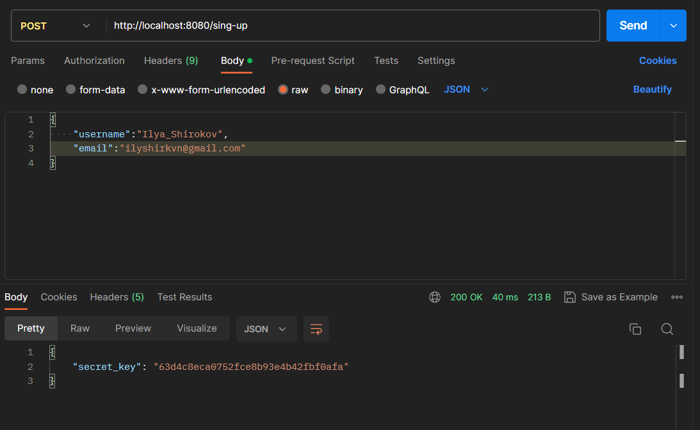
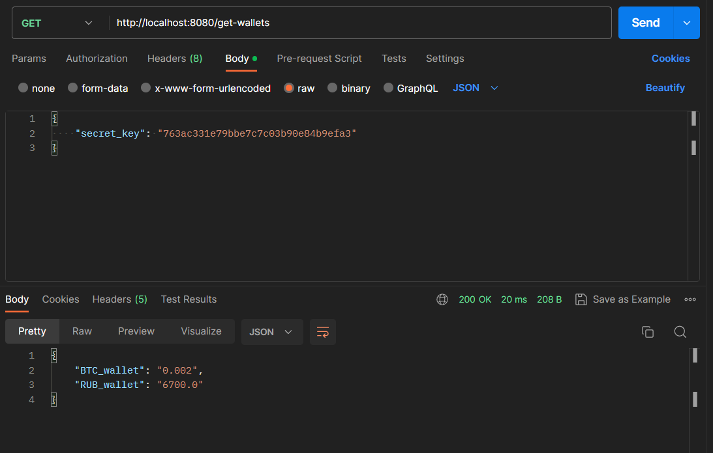
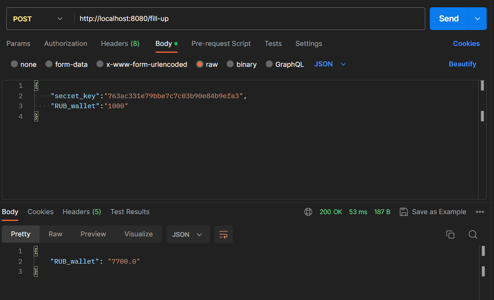
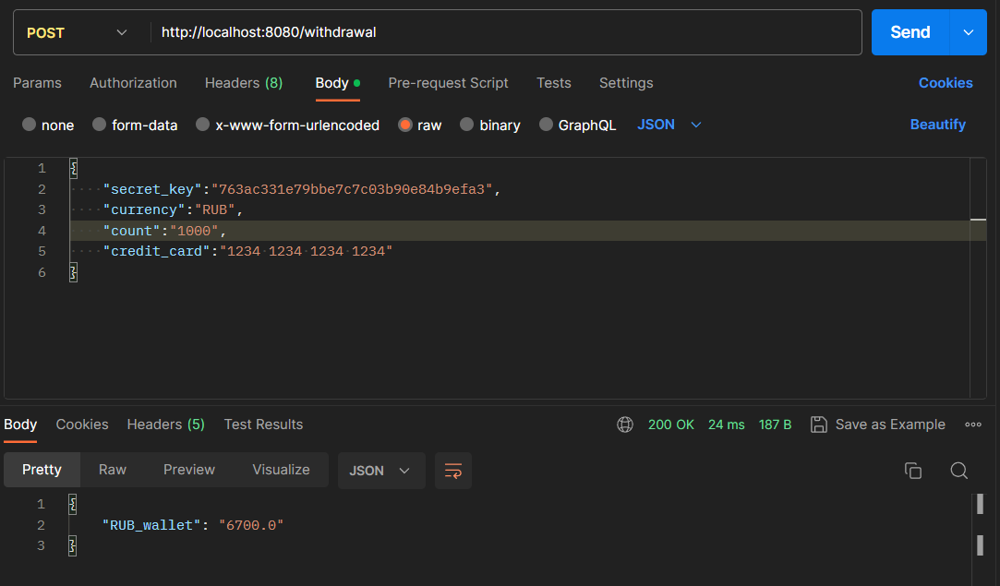
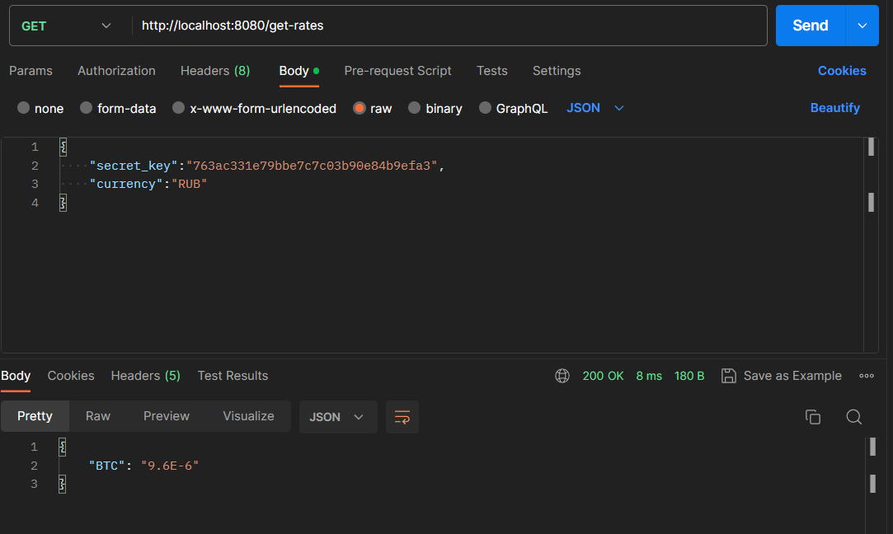
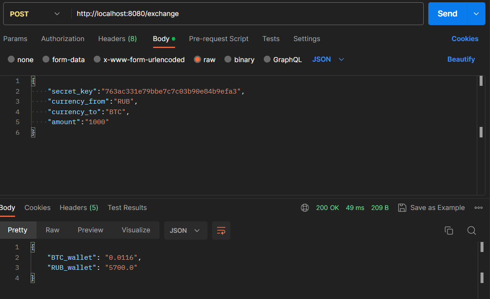

# Crypto

Упрощенная система криптобиржи. 
Реализована на Spring Boot. 
Все данные возвращаются в формате json.

## Реализованы следующие методы
#### Для Пользователя:
1. Регистрация нового пользователя;  
2. Просмотр баланса своего кошелька;  
3. Пополнение кошелька;  
4. Вывод денег с биржи;  
5. Просмотр актуальных курсов валют;  
6. Обмен валют по установленному курсу.  
#### Для Администратора:
1. Изменить курс валют;  
2. Просмотреть общую сумму на все счета указанной валюты;  
3. Просмотреть количество операций, которые были проведены за указанный период.  
#### Если у пользователя недостаточно прав, возввращается json {"error":"you_dont_have_enough_permissions"}

## Все данные сохраняются в бд PostgeSQL
Для подключения бд использовался Hibernate  
Имеется 4 таблицы:
1. users (поля: secret_key \<pk\>, username, email)
2. wallets (поля: id \<pk\>, secret_key \<fk\>, value, currency)
3. rates (поля: id \<pk\>, first_currency, second_currency, rate)
4. operations (поля: id \<pk\>, date, code)

